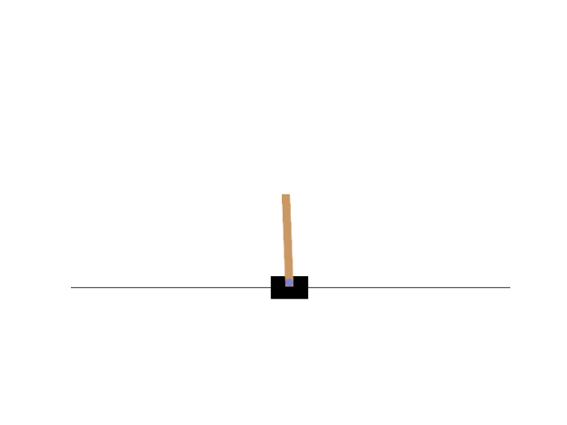

# RL_Framework_for_SPS

## Train RL Model

在Cart-Pole v1 和 Pendulum v1上完成训练
- PPO算法
- GRPO算法（无KL散度修正，暂无ref模型）

```--num_envs```为向量化环境数量，支持batch大于1

```
python3 train.py --algo ppo
```

### Cart Pole

 
 

### Pendulum

 
 